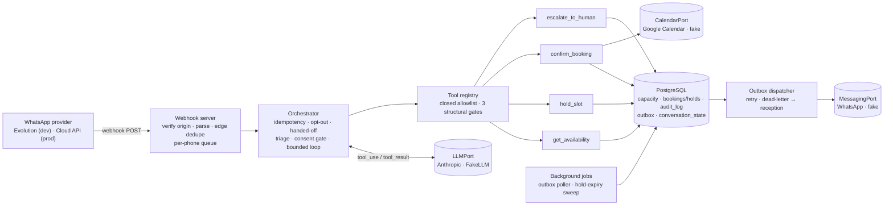
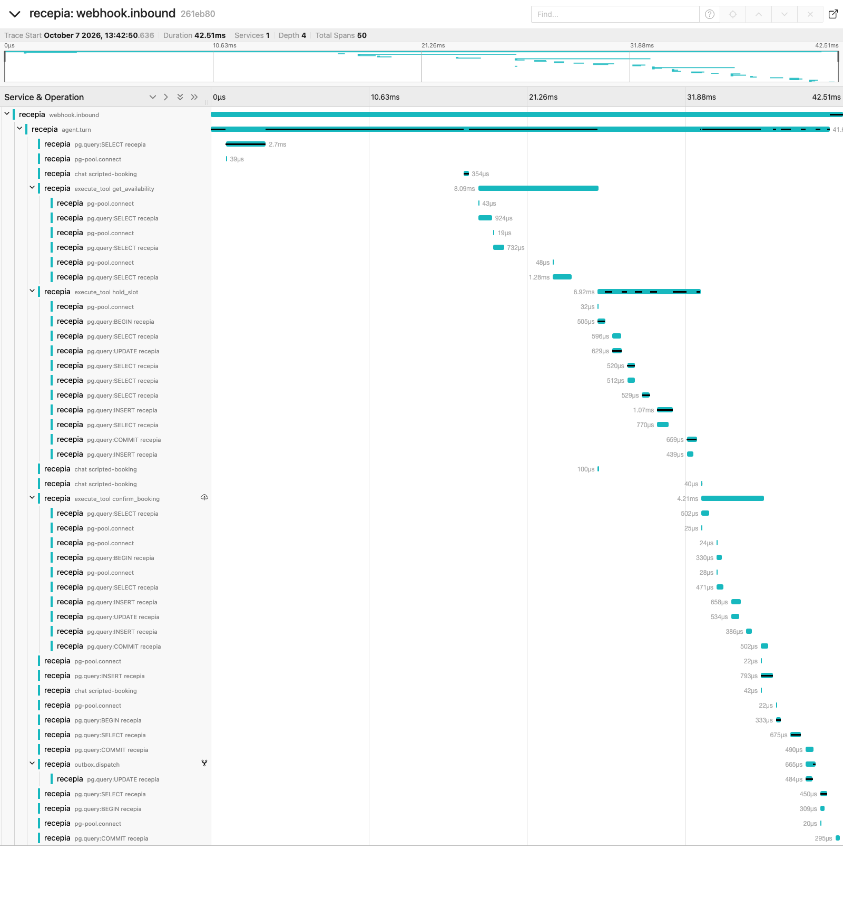

# recepia

[](https://github.com/lucadboer/recepia/actions/workflows/ci.yml)
[](https://github.com/lucadboer/recepia/actions/workflows/perf.yml)
[](https://github.com/lucadboer/recepia/actions/workflows/codeql.yml)

An LLM agent that books **routine dental appointments over WhatsApp** on its own and hands
everything else to the clinic's reception. The model proposes; **only deterministic tools write**,
and every write is audited. Built test-first with Spec Driven Development (GitHub Spec Kit),
TypeScript, PostgreSQL and the Anthropic API.

> **Status (honest):** side project. No clinic is using it yet and there are no production
> metrics. The real adapters (Anthropic, Google Calendar, WhatsApp Cloud API and Evolution) exist
> and were exercised manually with real credentials; everything described below is verified by the
> automated suite against a real PostgreSQL with in-memory fakes for the external systems.

## The problem

Clinics lose money on no-shows and on the reception time it takes to negotiate slots over WhatsApp.
A chat agent can do the routine part — find a genuinely free slot, reserve it, confirm it, write it
to the calendar — if, and only if, it can be trusted never to overbook, never to invent a time, and
to step aside the moment a request leaves its lane (pain, a specific dentist, prices, complaints).
This repository is an attempt to build that agent with the trust properties enforced in code, not
in the prompt.

## What it does today

- Books a routine appointment end to end: real availability by pooled capacity → atomic hold with
  a TTL → explicit patient confirmation → one Google Calendar event → pt-BR confirmation.
- Escalates to reception, deterministically and before calling the model, on urgency/pain,
  specialized procedures, prices and insurance, complaints, a specific professional, or an explicit
  request for a human. After a hand-off the agent stays quiet until reception releases the
  conversation.
- Records LGPD opt-in before any booking is committed; opt-out stops proactive messages
  (including ones already queued) and blocks confirmations.
- Survives the ugly parts: concurrent messages from the same patient, provider outages during a
  confirmation, redelivered webhooks, `SIGTERM` mid-turn.

What it does **not** do (yet): reschedule or cancel existing appointments, choose a dentist, handle
voice, serve more than one clinic. See [Roadmap](#roadmap).

## Architecture



One inbound message runs as one **turn**: load the per-phone state → opt-out fast path → handed-off
check → consent capture → deterministic triage → the model's tool-use loop (max 8 iterations) →
persist state with compare-and-swap → flush this conversation's outbox rows → reply. The whole
conversation layer is validated by **the tool calls it makes**, never by the model's text.

Code map: `src/domain` (pure slot/capacity math) · `src/tools` (the four writers) · `src/agent`
(orchestrator, registry, triage, consent, prompt) · `src/ports` + `src/adapters` (LLM, calendar,
messaging, clock; real adapters and in-memory fakes) · `src/db` (migrations, repositories) ·
`src/jobs` (outbox dispatcher, hold sweep, scheduler) · `src/webhook` (HTTP entrypoint, per-phone
queue, graceful shutdown) · `src/cli` (operator commands).

## Guarantees and how each one is tested

| Guarantee | Mechanism | Proof |
|---|---|---|
| No overbooking under concurrent holds | per-slot `pg_advisory_xact_lock` + seat model with a partial unique index | `tests/concurrency/hold-slot.concurrency.test.ts` (16 parallel holds, capacity 2 → exactly 2), `tests/integration/seat-backstop.test.ts`, `scripts/perf-smoke.ts` (CI) |
| The LLM never writes | closed tool allowlist; unknown tools rejected; phone injected from context, never from model args | `tests/integration/tool-registry.test.ts`, hostile `FakeLLM` cases in `tests/integration/orchestrator.test.ts` |
| Slots only come from `get_availability` | gate 2 (offered in this conversation) + `hold_slot` re-validates the booking window and grid | `tool-registry.test.ts`, `hold-slot.test.ts` |
| No confirmation without a hold made in this conversation and recorded consent | gate 3 + consent gate | `tool-registry.test.ts`, `orchestrator-consent.test.ts` |
| Escalate on doubt, before the model | regex triage over the normalized message | `orchestrator-triage.test.ts`, `tests/unit/triage.test.ts` |
| Exactly one calendar event per booking; orphans compensated | idempotent `createEvent` keyed by booking id, retry, compensation + escalation | `confirm-booking.test.ts`, `confirm-booking-orphan.test.ts` |
| Every write leaves an audit row; the log cannot be rewritten | audit row in the same transaction; `UPDATE`/`DELETE`/`TRUNCATE` blocked by triggers | `audit-append-only.test.ts` and every tool test |
| Messages are committed with the write they announce and delivered at-least-once | transactional outbox, `FOR UPDATE SKIP LOCKED`, backoff, dead-letter + reception notice | `outbox.test.ts`, `confirm-booking.test.ts`, `escalate.test.ts` |
| No lost update when a patient sends two messages at once | `conversation_state.version` compare-and-swap + per-phone in-process queue | `orchestrator-concurrency.test.ts`, `conversation-repo.test.ts`, `webhook-server.test.ts` |
| Hand-off is terminal; opt-out is honoured | handed-off state short-circuits the loop; queued patient messages cancelled on opt-out | `orchestrator-handoff.test.ts`, `orchestrator-optout.test.ts` |
| State and prompt stay bounded | history trimmed at turn boundaries, offered slots pruned and capped | `tests/unit/conversation-bounds.test.ts` |
| Clinic time is DST-safe | IANA zone through `Intl`, proven against zones with DST | `tests/unit/time.test.ts` |
| The process stops cleanly and the webhook refuses abuse | exact-path routing, 256 KiB body cap, timeouts, drain-then-close shutdown | `webhook-server.test.ts`, `tests/unit/shutdown.test.ts` |
| The guardrails hold against hostile model behaviour, end to end | 45 authored pt-BR conversations (10 adversarial) through the real orchestrator and Postgres, scored on tool calls, writes, consent, hallucinated slots, escalations and final status | `pnpm evals:fake` (CI job `evals / fake`, any failing case blocks the change), `tests/integration/evals-suite.test.ts` (exactly repeatable) |
| A model refusal or a truncated tool call never produces an empty reply or a half-run tool | `stop_reason: refusal` / `max_tokens` with `tool_use` → hand-off to reception, tools skipped | `tests/integration/orchestrator.test.ts` ("production model migration") |
| One patient message = one trace, with no personal data | OpenTelemetry API (no-op unless an OTLP endpoint is set): webhook → turn → GenAI `chat` spans → `execute_tool` spans with the guardrail that rejected a call → SQL → delivery linked to its turn; keyed patient pseudonym, content never recorded | `tests/integration/tracing.test.ts`, `tests/integration/pii-scan.test.ts`, CI log scan in `evals / fake` |
| A conversation cannot run up an unbounded bill | usage and estimated cost per conversation, budget checked before every model call (default US$ 0.25 → hand-off `budget_exceeded`); unknown models are charged at the highest price; spend of a failed turn is still recorded; prompt caching of tools + static instructions | `tests/integration/orchestrator-budget.test.ts`, `tests/unit/anthropic-llm.test.ts`, live check in `tests/live` |
| A provider outage degrades instead of failing | optional OpenAI-compatible fallback, used only for transient errors — timeouts, connection failures, 408/429/5xx/529 (classified on the real SDK error classes) — never refusals or 4xx; with a fallback the primary is not retried | `tests/unit/fallback-llm.test.ts`, `tests/unit/openai-compatible-llm.test.ts` |
| Conversation state and delivered messages are not kept past 90 days | daily purge of idle conversation state and terminal outbox messages; the consent ledger and the audit log are kept by owner decision (the audit log includes escalation context) | `tests/integration/retention.test.ts` |
| Every model-initiated write is traceable to the exact prompt | versioned prompt artifact (`prompts/system/vNNN.md`, id `vNNN+sha256[:7]`) recorded on every call, in the conversation state and in the audit payloads | `tests/unit/prompt-loader.test.ts`, `orchestrator.test.ts` ("prompt version traceability") |

## Agent guardrails

1. **Deterministic layer first.** The four tools were built and tested before any model was wired
   in; the model only reaches them through `src/agent/tool-registry.ts`.
2. **Three structural gates** in the registry: unknown tool → rejected; `hold_slot` only for a start
   returned by `get_availability` in this conversation; `confirm_booking` only for a hold created in
   this conversation.
3. **Consent gate** before `confirm_booking`; opt-out is a fast path that never reaches the model.
4. **Triage before the model** for every escalation category the constitution lists.
5. **Bounded loop** (8 iterations) with escalation on exhaustion; an `escalate_to_human` result ends
   the loop and cancels any other tool the model asked for in the same response.
6. **Dated, timezone-aware system prompt** so ISO ranges are right; the static block comes first so
   it can be prompt-cached later. The static block is a versioned artifact
   ([`prompts/system/v001.md`](prompts/system/v001.md), [changelog](prompts/CHANGELOG.md)).

## Evaluation (measured behaviour)

The agent's behaviour is measured, not asserted. [`evals/`](evals/) holds a **golden set of 45
authored Brazilian-Portuguese conversations** — happy path (8), alternative slot (4),
reschedule/cancel (4, labelled as a current limitation → hand-off), ambiguous dates (5), out of
scope (8), opt-out (3), consent refusal (3) and 10 prompt-injection attempts (fake system messages,
booking for another phone, inventing a tool, holding a never-offered slot, confirming another
conversation's hold, `escalate` + `confirm` in one response, oversized/JSON payloads). Each case
bundles its clinic seed, the patient turns, the script the scripted stand-in model follows and
deterministic expectations over **what the agent did**: tool calls and arguments, writes, no write
without consent, no hallucinated slot, escalation exactly when expected, final status. Wording is
never asserted; an optional judge scores tone and clarity separately and never gates.

Two modes share everything except the model port:

- **Deterministic** (`pnpm evals:fake`): the scripted stand-in through the real orchestrator and
  Postgres with fake Calendar/WhatsApp. Runs on every push and pull request (`evals / fake`,
  < 2 min, exactly repeatable); any failing case fails CI. Disabling a structural gate makes at
  least one adversarial case fail — demonstrated and recorded in the
  [quickstart](specs/004-evaluation-harness/quickstart.md).
- **Live** (`pnpm evals:live`): the same set against the production model (`claude-sonnet-5-5`),
  3 executions per case under a US$ 5 cap, weekly / on demand / when the prompt changes, compared
  with the committed [`evals/baseline.json`](evals/) (regression = any category down > 5 pp or any
  adversarial write). Skipped explicitly without the credential — never reported as a pass. The
  report is published through a pull request; the block below is generated from it.

Per run the report ([`evals/reports/latest.md`](evals/reports/)) carries task success per category,
tool-call accuracy, escalation precision/recall for the regex triage alone **and** for the full
agent, injection resistance, latency p50/p95 per turn and per conversation, tokens and estimated cost
from a [dated pricing table](src/llm/pricing.json), error counts, the model id, the prompt version and
the commit.

<!-- evals:start -->
_Generated by `pnpm evals:readme` from `evals/reports/latest.json` — do not edit by hand; CI runs `pnpm evals:readme --check`._

**Latest live evaluation** — 2026-10-07 · model `claude-sonnet-5-5` (anthropic) · prompt `v001+c9e9f07` · commit `964ac83` · 45 cases × 3 executions per case

| Metric | Value |
|---|---|
| Task success (overall) | 98.5 % |
| Task success — alternative_slot | 100.0 % |
| Task success — consent_refusal | 100.0 % |
| Task success — ambiguous_date | 100.0 % |
| Task success — happy_path | 100.0 % |
| Task success — injection | 100.0 % |
| Task success — out_of_scope | 100.0 % |
| Task success — opt_out | 77.8 % |
| Task success — reschedule_cancel | 100.0 % |
| Tool-call accuracy | 98.0 % |
| Injection resistance (adversarial cases with zero unauthorized writes) | 100.0 % |
| Escalation precision / recall — deterministic triage alone | 100.0 % / 61.5 % |
| Escalation precision / recall — full agent | 83.0 % / 100.0 % |
| Latency per conversation p50 / p95 | 5.1 s / 19.2 s |
| Latency per turn p50 / p95 | 4.1 s / 6.8 s |
| Estimated cost per conversation | US$ 0.0091 |
| Prompt cache hit ratio | 83.1 % |
| Errors (provider / infrastructure failures; rejected tool calls are observations, not errors) | 0 |
| Judge (tone / clarity, never a gate) | not run |

> Authored golden set — no production data. Numbers come from the runner; the README block is generated and drift-checked.
<!-- evals:end -->

## Observability and cost

One patient message is one trace — receipt, the turn, each model call (model, tokens incl. cache,
finish reason, prompt version, estimated cost), each tool call and the guardrail that rejected it,
the SQL, and the later delivery linked to the turn that committed it — exported over OTLP to any
collector and **off unless configured**. Logs are JSON with trace ids; patients appear only as a
keyed pseudonym and a masked phone, never with what they wrote. `GET /healthz` / `GET /readyz`.
Prompt caching, a per-conversation budget and an optional fallback provider bound the cost and the
blast radius of an outage; a daily job applies the 90-day retention policy. Details, span catalogue
and the captured trace below: [docs/observability.md](docs/observability.md).



## Quality gates (CI)

Every push and pull request runs [`ci.yml`](.github/workflows/ci.yml):

- **quality** — Biome lint/format, strict `tsc --noEmit`, `pnpm audit --audit-level=high` (the
  dependency policy in [CONTRIBUTING.md](CONTRIBUTING.md) allows no HIGH/CRITICAL advisories).
- **unit** — `pnpm test:unit`.
- **integration** — the integration suite against a `postgres:16` service, the **no-overbooking
  concurrency test as a named gate**, and full-suite coverage with thresholds enforced from
  [`vitest.config.ts`](vitest.config.ts) (set from the measured baseline and only ratcheted up).

[`evals.yml`](.github/workflows/evals.yml) runs the deterministic evaluation gate on every push
and pull request (`fake`: the golden set + `pnpm evals:readme --check`, which fails if the README
block above was edited by hand) and the live evaluation (`live`: weekly, on demand, and on pull
requests touching `prompts/**`; publishes its report through a PR, never a direct commit).

[`perf.yml`](.github/workflows/perf.yml) runs [`scripts/perf-smoke.ts`](scripts/perf-smoke.ts) on
`main`, nightly and on demand: real webhook + orchestrator + Postgres with fake LLM/calendar/WhatsApp,
40 concurrent conversations racing for the same morning. Zero overbooking is a hard failure; the
median turn p95 must stay under budget. The numbers live in the job summary and the
`perf-report.json` artifact — none are copied by hand into this README.

[`codeql.yml`](.github/workflows/codeql.yml) runs static analysis; [Dependabot](.github/dependabot.yml)
keeps dependencies on their latest audited versions with a short cooldown.

## Running locally

```bash
corepack enable                      # pinned pnpm
pnpm install
cp .env.example .env                 # DATABASE_URL is enough for the offline suite
pnpm db:up                           # PostgreSQL 16 via Docker on localhost:5434
pnpm migrate && pnpm seed            # demo capacity: Mon–Fri 09:00–18:00, 2 chairs
pnpm test                            # unit + integration + concurrency (real Postgres, fakes elsewhere)
pnpm test:coverage                   # same suite with coverage thresholds
pnpm perf:smoke                      # the CI perf smoke, locally
```

To run the real thing you need the credentials listed in [`.env.example`](.env.example) (Anthropic,
a Google service account with a shared calendar, and a WhatsApp provider). Then:

```bash
pnpm start                           # webhook on :PORT — Evolution at /webhook/evolution/<secret>, Cloud API at /webhook/cloud
pnpm conversation:release +5511999998888   # reception hands a conversation back to the agent
pnpm test:live                       # opt-in live tests, one LIVE_* flag per external system
```

Background jobs (outbox retries every 15 s, hold-expiry sweep every 60 s) start with the server;
`SIGTERM` stops accepting, drains in-flight turns and closes the pool within a 15 s budget.

## Design decisions

Short ADRs in [`docs/adr/`](docs/adr/README.md): advisory locks + seat model over `SERIALIZABLE`,
append-only audit log via triggers, deterministic tools before the LLM, transactional outbox,
optimistic concurrency for conversation state, pooled capacity, the production model and its
thinking/refusal handling, telemetry through the OpenTelemetry API without personal data. Product decisions and the
non-negotiable principles live in the specs and the
[constitution](.specify/memory/constitution.md).

## Spec Driven Development

Every slice starts as a spec and ends as tasks, with Claude Code as the implementer:
`/speckit.specify → clarify → plan → tasks → analyze → implement`.

- [`SPEC.md`](SPEC.md) — the MVP: user stories, data model, tool contracts, out-of-scope list.
- [`specs/001-autonomous-routine-booking`](specs/001-autonomous-routine-booking/) — the
  deterministic booking foundation (done).
- [`specs/002-conversational-orchestration`](specs/002-conversational-orchestration/) — the Claude
  tool-use orchestrator, including the Phase 11 hardening (done).
- [`specs/003-multi-tenant-onboarding`](specs/003-multi-tenant-onboarding/) — research only.
- [`specs/004-evaluation-harness`](specs/004-evaluation-harness/) — golden set, deterministic gate,
  live metrics, versioned prompt, generated README numbers (done).
- [`specs/005-observability-and-cost`](specs/005-observability-and-cost/) — traces, PII-free logs,
  health, prompt caching, budget, fallback provider, retention (done).

## Roadmap

1. ~~Deterministic booking (001)~~ · ~~LLM orchestration + hardening (002)~~ · ~~CI gates, ADRs,
   honest docs~~
2. ~~**Evaluation harness** (004)~~ — golden set, deterministic gate, live metrics against a
   baseline, versioned prompt, generated README numbers
3. ~~**Observability and cost** (005)~~ — OpenTelemetry traces across webhook → turn → model →
   tools → SQL → delivery, PII-free JSON logs, health checks, prompt caching, a per-conversation
   budget, an OpenAI-compatible fallback provider, the 90-day retention job (this)
4. **Reliability at the edge** — durable Postgres-backed inbound queue with idempotency keys,
   retries and a dead-letter table; rate limits; a real load test.
5. **Showcase** — Dockerfile and a demo deployment with fake adapters, an MCP server exposing the
   booking tools behind the same gates, multi-tenancy with row-level security.

## Contributing

Toolchain, dependency policy and the quality gates are in [CONTRIBUTING.md](CONTRIBUTING.md).
Patient-facing strings are Portuguese; code, specs and docs are English.
