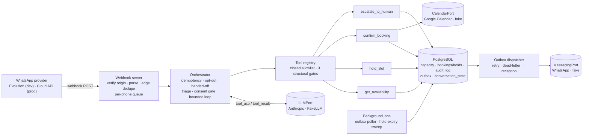

# recepia

[](https://github.com/lucadboer/recepia/actions/workflows/ci.yml)
[](https://github.com/lucadboer/recepia/actions/workflows/perf.yml)
[](https://github.com/lucadboer/recepia/actions/workflows/codeql.yml)

An LLM agent that books **routine dental appointments over WhatsApp** on its own and hands
everything else to the clinic's reception. The model proposes; **only deterministic tools write**,
and every write is audited. Built test-first with Spec Driven Development (GitHub Spec Kit),
TypeScript, PostgreSQL and the Anthropic API.

> **Status (honest):** side project. No clinic is using it yet and there are no production
> metrics. The real adapters (Anthropic, Google Calendar, WhatsApp Cloud API and Evolution) exist
> and were exercised manually with real credentials; everything described below is verified by the
> automated suite against a real PostgreSQL with in-memory fakes for the external systems.

## The problem

Clinics lose money on no-shows and on the reception time it takes to negotiate slots over WhatsApp.
A chat agent can do the routine part — find a genuinely free slot, reserve it, confirm it, write it
to the calendar — if, and only if, it can be trusted never to overbook, never to invent a time, and
to step aside the moment a request leaves its lane (pain, a specific dentist, prices, complaints).
This repository is an attempt to build that agent with the trust properties enforced in code, not
in the prompt.

## What it does today

- Books a routine appointment end to end: real availability by pooled capacity → atomic hold with
  a TTL → explicit patient confirmation → one Google Calendar event → pt-BR confirmation.
- Escalates to reception, deterministically and before calling the model, on urgency/pain,
  specialized procedures, prices and insurance, complaints, a specific professional, or an explicit
  request for a human. After a hand-off the agent stays quiet until reception releases the
  conversation.
- Records LGPD opt-in before any booking is committed; opt-out stops proactive messages
  (including ones already queued) and blocks confirmations.
- Survives the ugly parts: concurrent messages from the same patient, provider outages during a
  confirmation, redelivered webhooks, `SIGTERM` mid-turn.

What it does **not** do (yet): reschedule or cancel existing appointments, choose a dentist, handle
voice, serve more than one clinic. See [Roadmap](#roadmap).

## Architecture



One inbound message runs as one **turn**: load the per-phone state → opt-out fast path → handed-off
check → consent capture → deterministic triage → the model's tool-use loop (max 8 iterations) →
persist state with compare-and-swap → flush this conversation's outbox rows → reply. The whole
conversation layer is validated by **the tool calls it makes**, never by the model's text.

Code map: `src/domain` (pure slot/capacity math) · `src/tools` (the four writers) · `src/agent`
(orchestrator, registry, triage, consent, prompt) · `src/ports` + `src/adapters` (LLM, calendar,
messaging, clock; real adapters and in-memory fakes) · `src/db` (migrations, repositories) ·
`src/jobs` (outbox dispatcher, hold sweep, scheduler) · `src/webhook` (HTTP entrypoint, per-phone
queue, graceful shutdown) · `src/cli` (operator commands).

## Guarantees and how each one is tested

| Guarantee | Mechanism | Proof |
|---|---|---|
| No overbooking under concurrent holds | per-slot `pg_advisory_xact_lock` + seat model with a partial unique index | `tests/concurrency/hold-slot.concurrency.test.ts` (16 parallel holds, capacity 2 → exactly 2), `tests/integration/seat-backstop.test.ts`, `scripts/perf-smoke.ts` (CI) |
| The LLM never writes | closed tool allowlist; unknown tools rejected; phone injected from context, never from model args | `tests/integration/tool-registry.test.ts`, hostile `FakeLLM` cases in `tests/integration/orchestrator.test.ts` |
| Slots only come from `get_availability` | gate 2 (offered in this conversation) + `hold_slot` re-validates the booking window and grid | `tool-registry.test.ts`, `hold-slot.test.ts` |
| No confirmation without a hold made in this conversation and recorded consent | gate 3 + consent gate | `tool-registry.test.ts`, `orchestrator-consent.test.ts` |
| Escalate on doubt, before the model | regex triage over the normalized message | `orchestrator-triage.test.ts`, `tests/unit/triage.test.ts` |
| Exactly one calendar event per booking; orphans compensated | idempotent `createEvent` keyed by booking id, retry, compensation + escalation | `confirm-booking.test.ts`, `confirm-booking-orphan.test.ts` |
| Every write leaves an audit row; the log cannot be rewritten | audit row in the same transaction; `UPDATE`/`DELETE`/`TRUNCATE` blocked by triggers | `audit-append-only.test.ts` and every tool test |
| Messages are committed with the write they announce and delivered at-least-once | transactional outbox, `FOR UPDATE SKIP LOCKED`, backoff, dead-letter + reception notice | `outbox.test.ts`, `confirm-booking.test.ts`, `escalate.test.ts` |
| No lost update when a patient sends two messages at once | `conversation_state.version` compare-and-swap + per-phone in-process queue | `orchestrator-concurrency.test.ts`, `conversation-repo.test.ts`, `webhook-server.test.ts` |
| Hand-off is terminal; opt-out is honoured | handed-off state short-circuits the loop; queued patient messages cancelled on opt-out | `orchestrator-handoff.test.ts`, `orchestrator-optout.test.ts` |
| State and prompt stay bounded | history trimmed at turn boundaries, offered slots pruned and capped | `tests/unit/conversation-bounds.test.ts` |
| Clinic time is DST-safe | IANA zone through `Intl`, proven against zones with DST | `tests/unit/time.test.ts` |
| The process stops cleanly and the webhook refuses abuse | exact-path routing, 256 KiB body cap, timeouts, drain-then-close shutdown | `webhook-server.test.ts`, `tests/unit/shutdown.test.ts` |

## Agent guardrails

1. **Deterministic layer first.** The four tools were built and tested before any model was wired
   in; the model only reaches them through `src/agent/tool-registry.ts`.
2. **Three structural gates** in the registry: unknown tool → rejected; `hold_slot` only for a start
   returned by `get_availability` in this conversation; `confirm_booking` only for a hold created in
   this conversation.
3. **Consent gate** before `confirm_booking`; opt-out is a fast path that never reaches the model.
4. **Triage before the model** for every escalation category the constitution lists.
5. **Bounded loop** (8 iterations) with escalation on exhaustion; an `escalate_to_human` result ends
   the loop and cancels any other tool the model asked for in the same response.
6. **Dated, timezone-aware system prompt** so ISO ranges are right; the static block comes first so
   it can be prompt-cached later.

## Quality gates (CI)

Every push and pull request runs [`ci.yml`](.github/workflows/ci.yml):

- **quality** — Biome lint/format, strict `tsc --noEmit`, `pnpm audit --audit-level=high` (the
  dependency policy in [CONTRIBUTING.md](CONTRIBUTING.md) allows no HIGH/CRITICAL advisories).
- **unit** — `pnpm test:unit`.
- **integration** — the integration suite against a `postgres:16` service, the **no-overbooking
  concurrency test as a named gate**, and full-suite coverage with thresholds enforced from
  [`vitest.config.ts`](vitest.config.ts) (set from the measured baseline and only ratcheted up).

[`perf.yml`](.github/workflows/perf.yml) runs [`scripts/perf-smoke.ts`](scripts/perf-smoke.ts) on
`main`, nightly and on demand: real webhook + orchestrator + Postgres with fake LLM/calendar/WhatsApp,
40 concurrent conversations racing for the same morning. Zero overbooking is a hard failure; the
median turn p95 must stay under budget. The numbers live in the job summary and the
`perf-report.json` artifact — none are copied by hand into this README.

[`codeql.yml`](.github/workflows/codeql.yml) runs static analysis; [Dependabot](.github/dependabot.yml)
keeps dependencies on their latest audited versions with a short cooldown.

## Running locally

```bash
corepack enable                      # pinned pnpm
pnpm install
cp .env.example .env                 # DATABASE_URL is enough for the offline suite
pnpm db:up                           # PostgreSQL 16 via Docker on localhost:5434
pnpm migrate && pnpm seed            # demo capacity: Mon–Fri 09:00–18:00, 2 chairs
pnpm test                            # unit + integration + concurrency (real Postgres, fakes elsewhere)
pnpm test:coverage                   # same suite with coverage thresholds
pnpm perf:smoke                      # the CI perf smoke, locally
```

To run the real thing you need the credentials listed in [`.env.example`](.env.example) (Anthropic,
a Google service account with a shared calendar, and a WhatsApp provider). Then:

```bash
pnpm start                           # webhook on :PORT — Evolution at /webhook/evolution/<secret>, Cloud API at /webhook/cloud
pnpm conversation:release +5511999998888   # reception hands a conversation back to the agent
pnpm test:live                       # opt-in live tests, one LIVE_* flag per external system
```

Background jobs (outbox retries every 15 s, hold-expiry sweep every 60 s) start with the server;
`SIGTERM` stops accepting, drains in-flight turns and closes the pool within a 15 s budget.

## Design decisions

Short ADRs in [`docs/adr/`](docs/adr/README.md): advisory locks + seat model over `SERIALIZABLE`,
append-only audit log via triggers, deterministic tools before the LLM, transactional outbox,
optimistic concurrency for conversation state, pooled capacity. Product decisions and the
non-negotiable principles live in the specs and the
[constitution](.specify/memory/constitution.md).

## Spec Driven Development

Every slice starts as a spec and ends as tasks, with Claude Code as the implementer:
`/speckit.specify → clarify → plan → tasks → analyze → implement`.

- [`SPEC.md`](SPEC.md) — the MVP: user stories, data model, tool contracts, out-of-scope list.
- [`specs/001-autonomous-routine-booking`](specs/001-autonomous-routine-booking/) — the
  deterministic booking foundation (done).
- [`specs/002-conversational-orchestration`](specs/002-conversational-orchestration/) — the Claude
  tool-use orchestrator, including the Phase 11 hardening (done).
- [`specs/003-multi-tenant-onboarding`](specs/003-multi-tenant-onboarding/) — research only.

## Roadmap

1. ~~Deterministic booking (001)~~ · ~~LLM orchestration + hardening (002)~~ · ~~CI gates, ADRs,
   honest docs~~ (this)
2. **Evaluation harness** — a golden set of pt-BR conversations (happy path, ambiguity, out of scope,
   consent, prompt injection) scored on tool calls, writes and escalations; metrics reported by
   script and shown here with date and model.
3. **Observability and cost** — OpenTelemetry traces across webhook → turn → model → tools → SQL,
   structured logs with PII masking, prompt caching and a per-conversation budget, a second LLM
   provider with fallback.
4. **Reliability at the edge** — durable Postgres-backed inbound queue with idempotency keys,
   retries and a dead-letter table; rate limits; a real load test.
5. **Showcase** — Dockerfile and a demo deployment with fake adapters, an MCP server exposing the
   booking tools behind the same gates, multi-tenancy with row-level security.

## Contributing

Toolchain, dependency policy and the quality gates are in [CONTRIBUTING.md](CONTRIBUTING.md).
Patient-facing strings are Portuguese; code, specs and docs are English.
